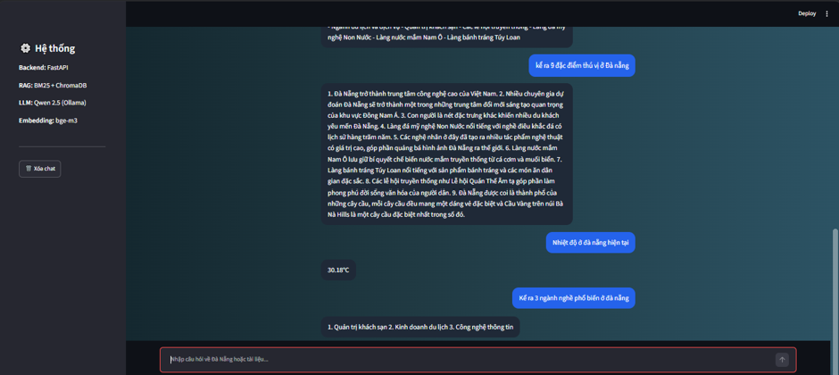

# Da Nang AI Chatbot – Hybrid RAG System

Hệ thống AI Chatbot tư vấn thông tin về Đà Nẵng, ứng dụng kiến trúc Hybrid RAG để truy xuất thông tin từ tài liệu PDF.

## 📸 Demo

## 🛠 Tech Stack
- **Framework**: Streamlit (UI), FastAPI (Backend).
- **Retrieval**: Hybrid Search (BM25 + ChromaDB + bge-m3 embeddings).
- **LLM**: Qwen 2.5 (via Ollama).
- **Logic**: Intent Routing & RAG Pipeline.

## 📂 Structure
- `api.py`: Backend services.
- `app.py`: Streamlit dashboard.
- `chatbot.py`: Core RAG & Logic.
- `ingest.py`: Data processing pipeline.
